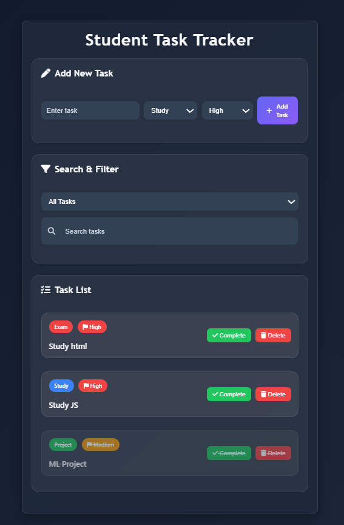
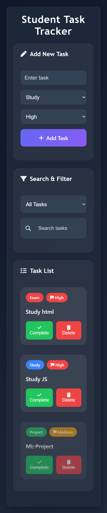
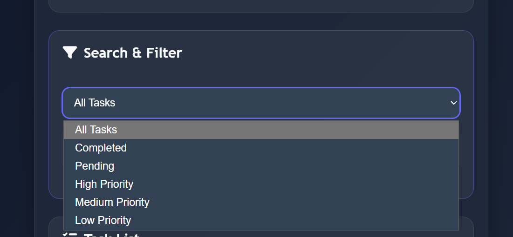
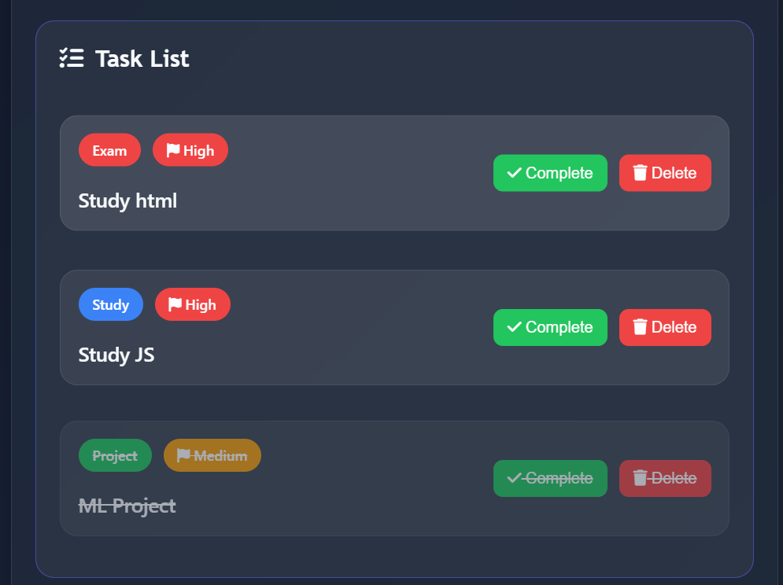

# Student Task Tracker

## Description

Student Task Tracker is a modern and responsive task management web application developed using HTML, CSS, and JavaScript. The application helps students organize and manage their daily tasks efficiently with features like categories, priority levels, filters, search functionality, and Local Storage support.

The application includes a redesigned UI with a modern dark theme, responsive layouts, colorful badges, icons, and an improved user experience for both desktop and mobile devices.

---

## Features

- Add Tasks
- Delete Tasks
- Complete Tasks
- Search Tasks
- Task Categories
- Priority Levels
- Priority-Based Sorting
- Task Filters
- Local Storage Support
- Responsive UI Design
- Modern Dark Theme
- Font Awesome Icons
- Mobile-Friendly Layout

---

## Task Categories

- Study
- Project
- Exam
- Personal
- Fitness

---

## Priority Levels

- High
- Medium
- Low

Tasks are automatically arranged based on priority levels.

---

## Filter Options

- All Tasks
- Completed Tasks
- Pending Tasks
- High Priority
- Medium Priority
- Low Priority

---

## Technologies Used

- HTML
- CSS
- JavaScript
- Local Storage
- Font Awesome
- Git & GitHub

---

# Project Structure

```text
student-task-tracker/
│
├── index.html
│
├── css/
│   └── style.css
│
├── js/
│   ├── app.js
│   ├── storage.js
│   └── ui.js
│
├── assets/
│   ├── home.png
│   ├── mobile-view.png
│   ├── filters.png
│   └── task-list.png
│
└── README.md
```

---

## UI Improvements

- Redesigned modern interface
- Dark theme UI
- Gradient buttons
- Category badges
- Priority badges
- Hover animations
- Better mobile responsiveness
- Improved typography
- Better section organization
- Responsive task cards
- Modern search and filter section
- Interactive icons using Font Awesome

---

## Git Workflow

- Feature Branch Workflow
- Pull Requests
- Merge Workflow
- Git Commit Standards
- Separate feature branches for each functionality
- Regular commits and pushes
- GitHub repository management

---

## Screenshots

### Home Page



### Mobile View



### Filters & Priority Levels



### Task List



---

## Future Improvements

- Edit Task Feature
- Dark/Light Mode Toggle
- Due Dates
- Drag and Drop Tasks
- Task Statistics Dashboard
- Toast Notifications
- Task Deadline Reminders
- User Authentication
- Cloud Database Integration
- Progress Tracking

---

## Author

Kamalesh A