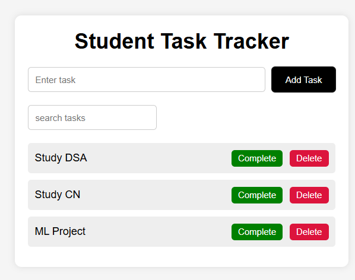
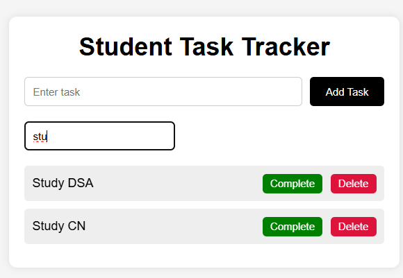
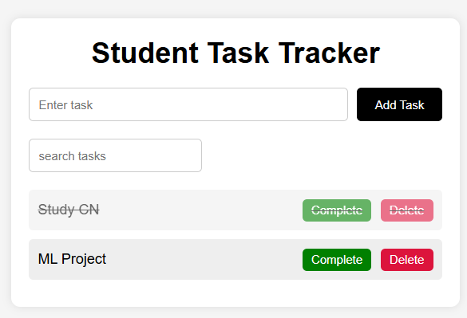

# Student Task Tracker

## Description
A responsive task management application for students built using HTML, CSS, and Javascript.

## Features
- Add tasks
- Delete tasks
- Complete tasks
- Search tasks
- Local Storage Support
- Responsive UI

## Technologies
- HTML
- CSS
- Javascript
- Local Storage
- Git & GitHub

# Project Structure

```text
student-task-tracker/
│
├── index.html
├── css/
│   └── style.css
│
├── js/
│   ├── app.js
│   ├── storage.js
│   └── ui.js
│
├── assets/
│   ├── Home.png
│   ├── Search.png
│   └── Delete_and_Complete.png
│
└── README.md

## Git Workflow
- Feature branches
- Pull Requests
- Merge workflow

## Screenshots

### Home Page



### Search Page



### Deleted and Completed Page




## Author
Kamalesh A